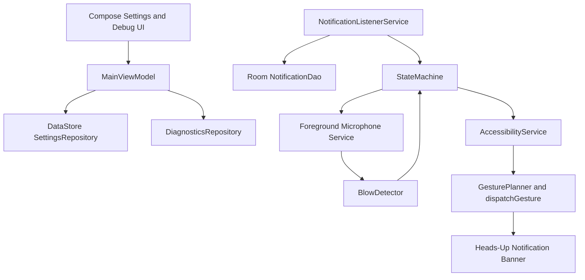

# Architecture

## Permission Flow

1. User grants microphone permission from the main screen.
2. User enables BlowAway in Android accessibility settings.
3. User enables notification listener access.
4. The foreground microphone service starts and remains idle until a notification listener event opens the active heads-up window.
5. During the active window, audio frames are analyzed locally. A confirmed blow requests an accessibility swipe from cached bounds or window metrics fallback.

## State Machine

`Idle -> NotificationActive -> ListeningForBlow -> BlowConfirmed -> SwipeGestureExecuted -> Cooldown -> Idle`

The microphone service only analyzes frames in `ListeningForBlow`, which limits battery use and reduces false triggers.
